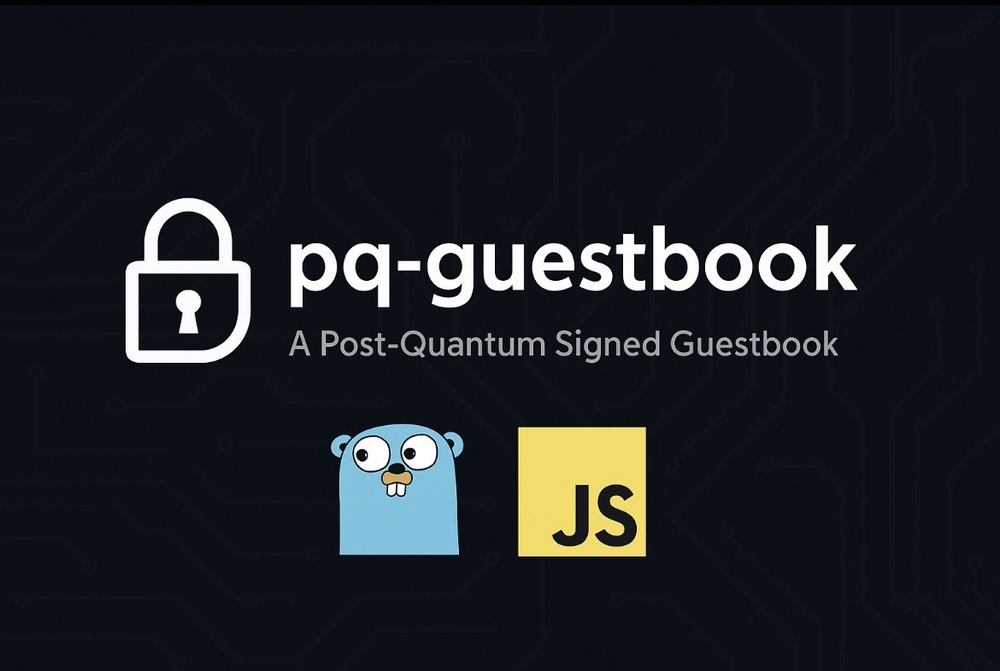
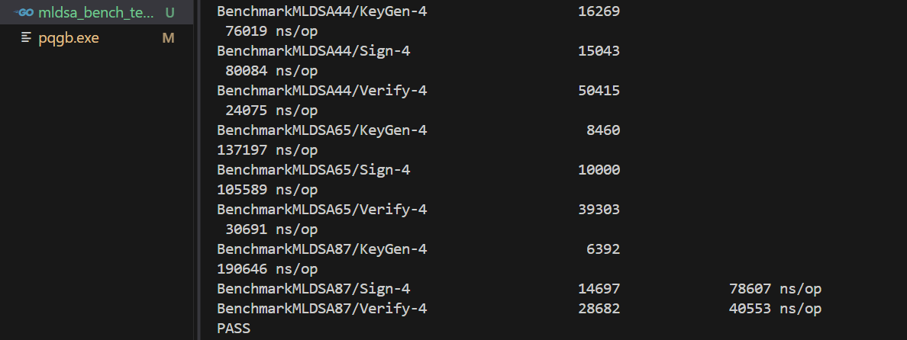
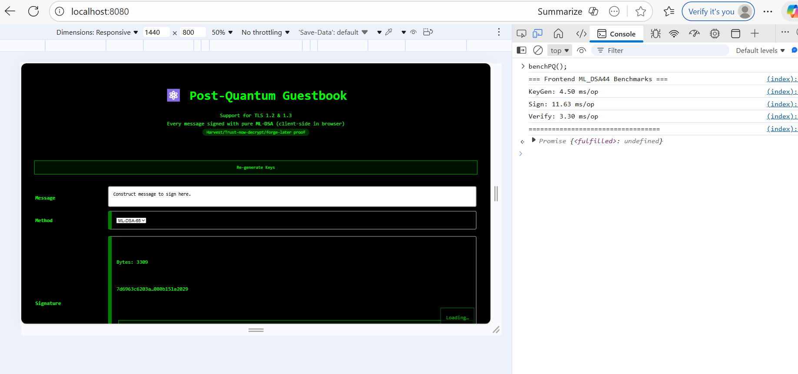
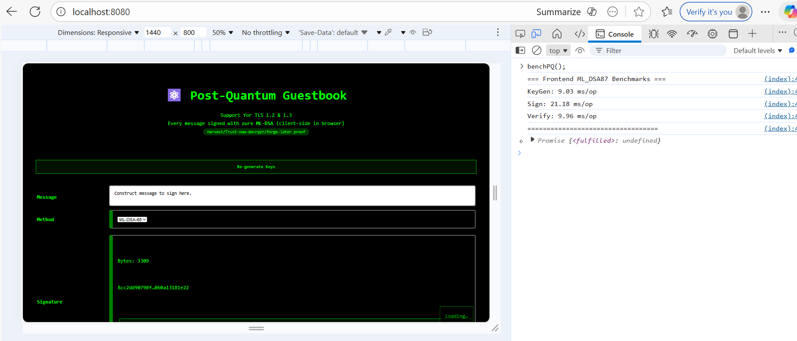
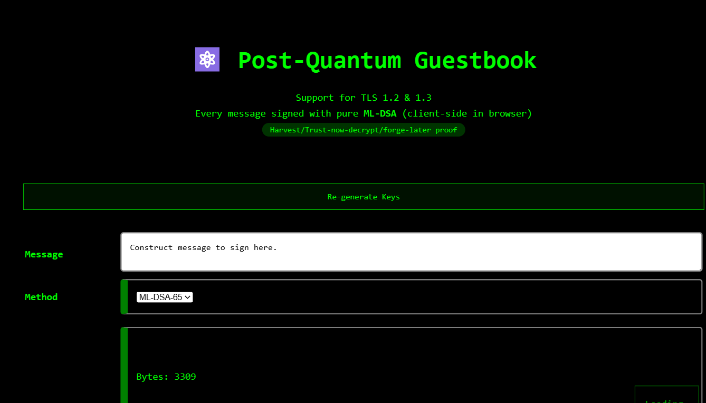
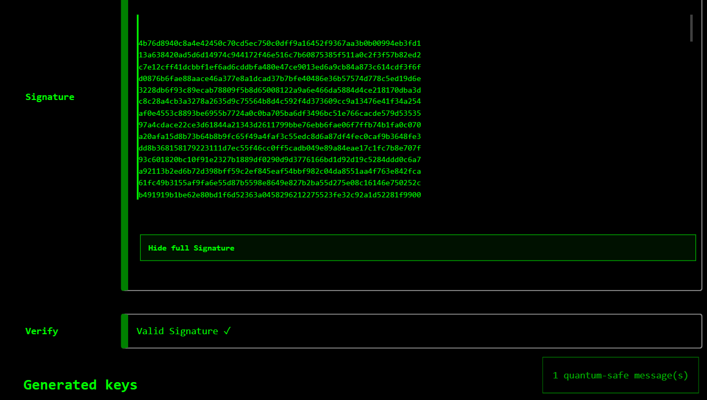
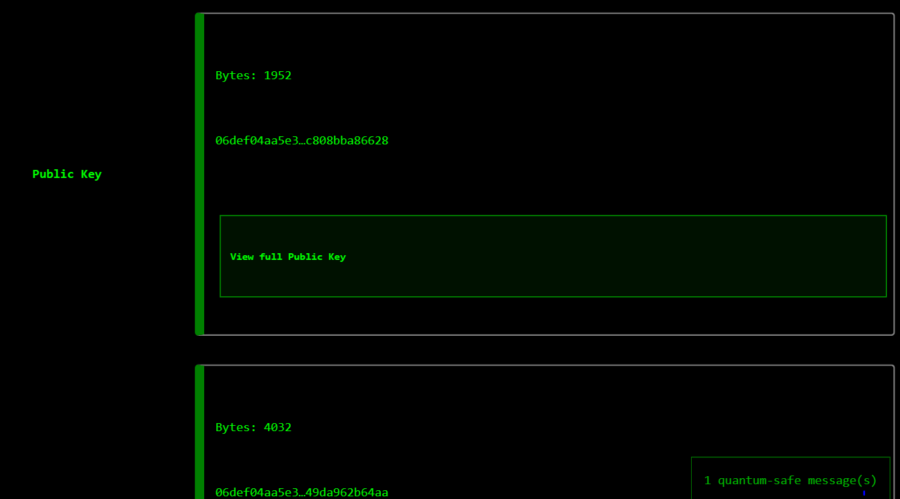
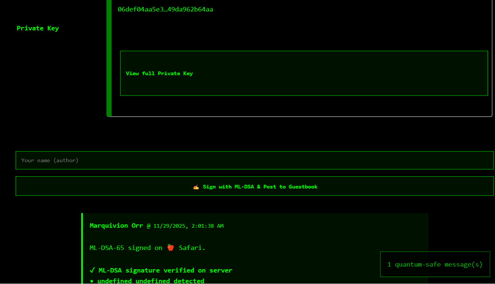
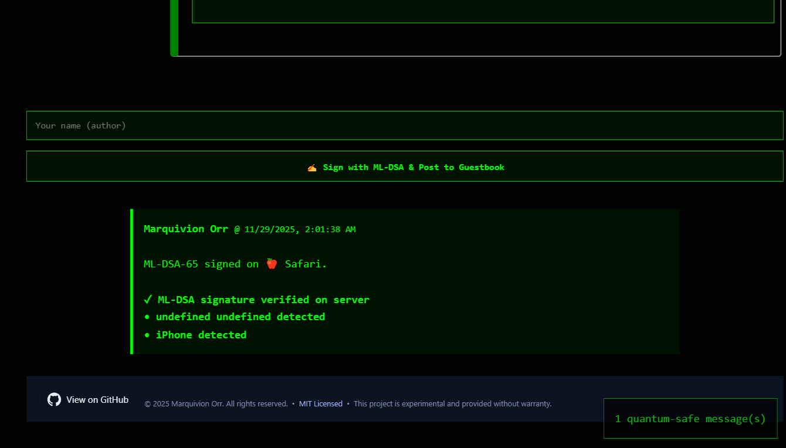

# ⚛️ Post-Quantum Guestbook: PQ Signatures (ML-DSA) in the browser • Verified in Go • Ready for the PQ Web

[](https://opensource.org/licenses/MIT)



<br>
<br>

## Overview

**Post-Quantum Guestbook** is a fully functional web app demonstrating **real post-quantum digital signatures running natively in the browser**, with verification on a Go backend.

This project is one of the earliest real-world examples of:

### ✔️ **Browser-side ML-DSA (Dilithium) signing**

### ✔️ **Backend ML-DSA verification in Go (Cloudflare CIRCL)**

### ✔️ **Randomized PQ signatures (random seed)**

### ✔️ **No elliptic-curve cryptography anywhere in the application authentication path**

**This is *not* a simulation. It is a pure PQ signature system running in production today.**

<br>
<br>

## ❓ Why This Matters

Current web apps rely almost entirely on classical cryptography (RSA, ECDSA, X25519).
These will be breakable by future quantum computers.

This project demonstrates:

### 🔐 Authenticity that **cannot be forged** now or by any future quantum computer

### 🔐 Messages that **cannot be spoofed**, even if TLS traffic is recorded forever

### 🔐 A browser that acts as a **true PQ identity**, no servers or extensions needed

This is essentially the **“Hello, World” of real post-quantum web applications**. Built to help onboard developers/engineers/researchers to PQC, shared initially in Cyfrin discord. Join us!: https://discord.gg/cyfrin
<br>
<br>

## 💡 Key Features

### 🔏 **Post-Quantum Signatures (Client)**

* Implemented with `@noble/post-quantum` (ML-DSA / Dilithium)
* Keys generated in the browser
* Each guestbook entry is **signed client-side**
* Signatures are **randomized and unique each time**, as permitted by the ML-DSA (FIPS-204) standard and implemented by the client-side JavaScript library used in this project.

### 🔐 **Post-Quantum Verification (Server)**

* Backend written in Go 1.25
* Uses **Cloudflare CIRCL** (`github.com/cloudflare/circl`)
* Supports verifying ML-DSA-44, ML-DSA-65, ML-DSA-87
* No ECC signatures involved at all

### 🏗 **Simple, Transparent Stack**

* Frontend: Plain HTML + ES modules
* Backend: Minimal Go HTTP server
* No build tools, bundlers, or frameworks
* Works in modern Chromium-based browsers today

<br>
<br>

## 🔒 Security Model

### ✔ **Post-Quantum Authentication — YES**

Message authenticity/security is fully PQ-safe:

* Users sign entries using ML-DSA
* Server verifies them using CIRCL
* No classical crypto is used for identity or signatures
* A future CRQC **cannot forge or modify entries**

### ⚠ **Transport Layer (TLS) — Classical Only (for now)**

This app is deployed on Fly.io.
Fly.io provides support for **TLS 1.2** and **TLS 1.3** with strong ciphers.

* TLS handshake = **classical (X25519)**
* TLS certificate = **classical ECDSA P-384** (from Let’s Encrypt)
* Transport confidentiality in this demo is *not* PQ-resistant against harvest-now-decrypt-later adversaries

**However:**
Because authentication is entirely PQ-signature–based, TLS is *not* part of the trust path for message authenticity.

The project remains a **valid demonstration of real post-quantum authentication**, independent of TLS.

<br>
<br>

### 🧭 Future Roadmap

Support for true PQ TLS could be added by:

* Cloudflare’s PQ-KEM TLS edge
* Using a self-hosted PQ-TLS terminator (OpenSSL-OQS / Rustls-PQ)
* Migrating to a hosting provider with PQ KEM support when available

<br>
<br>

## 🛠 Tech Stack

**Frontend**

* HTML, CSS, + JavaScript ES Modules
* CDN `@noble/post-quantum` (ML-DSA keygen + sign)
* No bundler, no build step

**Backend**

* Go v1.25.4
* Cloudflare CIRCL (pure-Go ML-DSA verification)
* JSON REST API

**Deployment**

* Fly.io via Dockerfile and flyctl
* Also deployable on Vercel, Render, Docker, etc.

<br>
<br>

## Running Locally

### Install dependencies

```bash
go mod tidy
```

### Generate 32-byte random hex using secure random-bytes generator and set equal to RATE_LIMIT_SECRET

**Using openssl**

```bash
openssl rand -hex 32
```

**Update main.go**

```bash
var rateLimitSecret = []byte("RATE_LIMIT_SECRET") // For local testing only, replace RATE_LIMIT_SECRET with a 32-byte random string
```

```bash
const secret = "RATE_LIMIT_SECRET" // For local testing only, replace RATE_LIMIT_SECRET with a 32-byte random string
```

### Start server

```bash
go run .
```

### Open browser

Visit:

```bash
http://localhost:8080
```

Sign a message → send to server → server verifies PQ signature.

<br>
<br>

## 📚 Screenshots / Demo

### Benchmarks



**Run this command for Go backend ns/op benchmarks across security levels**

```bash
go test -bench .
```

**Run this command for additional allocation stats:**

```bash
go test -run=^$ -bench . -benchmem
```

**Call this in the browser console for JS client-side ns/op benchmarks:**

```bash
benchPQ();
```

**Modify JS method value to test different security levels and recall benchPQ(); in browser console:**

```bash
const method = "ml_dsa65"; // Change to "ml_dsa44" or "ml_dsa87" to test other levels
```





<br><br>
## UI







<br>
<br>

## 📄 License

MIT.

<br>
<br>

## 🤝 Contributing

PRs welcome, especially for:

* PQ TLS integration
* WebCrypto implementations
* Additional ML-DSA variants
* Browser API hardening

## References

Buchanan, William J (2025). NIST FIPS 204 (ML-DSA) with JavaScript. Asecuritysite.com. https://asecuritysite.com/dilithium/crypt_ml_dsa
